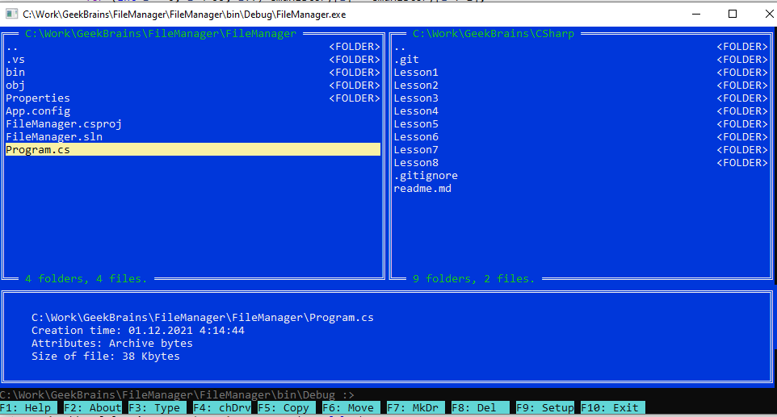

This is JackenQuake repository.
Synchronized with GitHub.

## 1. ИНТЕРФЕЙС ПРОГРАММЫ И КРАТКОЕ РУКОВОДСТВО ПОЛЬЗОВАТЕЛЯ



В сооветствии с моим пониманием технического задания, файловый менеджер
является гибридом оконного менеджера текстового режима (вдохновленного
Norton Commancder или Far Manager) и процессора командной строки,
предоставляя оба способа управления.

При этом в верхней части окна программы находятся две панели, отображающие
различные каталоги, под ними область информации о текущем файле, и в нижней
части экрана командная строка. Пользователь может переключаться между ними
клавишей TAB (по кругу - левая панель, правая панель, командная строка).

При активной командной строке доступны следующие команды:
  - cp <источник> <место назначения> - копирование файлов или каталогов если
  в качестве источника указан файл, а место назначение - существующий каталог,
  файл копируется в этот каталог под старыми именем иначе, если в качестве
  источника указан файл, место назначения трактуется как новое имя файла
  если же в качестве источника указан каталог - осуществляется (рекурсивное)
  копирование со всеми подкаталогами и входящими файлами.
  - mv <источник> <место назначения> - перемещение файлов, аналогично
  - rm <имя> - удаление файла или (рекурсивное) удаление каталогов
  - md <имя> - создание каталога, если ввести просто md, программа предложит 
    ввести имя.
  - tp <имя> - печать файла с паузами между страницами.
  - ls <путь> - печать указанного каталога, или текущего, если путь не указан
     печать осущствляется с разбивкой на страницы.
     команда принимает следующие ключи:
       - -d - печать только подкаталогов.
       - -f - печать только файлов.
       - -p <номер> - вывод начинается со страницы с указанным номером.
  - cd <путь> - смена каталога.
  - exit - выход из программы.
  - help или /? - вывод краткой подсказки по командам.
При этом стрелки вверх/вниз позволяют выбирать из истории команд (запоминается
100 команд), доступно редактирование с помощью Backspace и ввод команд клавишей
Enter.
   
При активных панелях выбор файлов осуществляется стрелками вверх/вних,
переход в под- и надкаталоги клавшей ENTER, и основные действия доступны
через функциональные клавиши (технически вызывающие соответствующие
функции командной строки):
  - традиционные:
    - F3 - просмотр, реализован как печать с паузами между страницами (tp)
    - F5 - копирование (cp)
    - F6 - перенос (mv)
    - F7 - создание подкаталога (md без параметров, имя будет запрошено)
    - F8 - удаление (rm)
  - дополнительные
    - F4 - выбор диска для текущей панели (в окне выводится краткая
      информация обо всех накопителях в системе; при этом по моему
      опыту запросы к сетевые дискам на отключенных компьютерах
      приводят к "зависанию" на очень долгое время, поэтому для
      них вывод отключен)
  - доступны также и из командной строки
    - F1 - вывод окна со справкой (аналог команды help)
    - F2 - вывод окна с информацией о программе (About)
    - F9 - ввод настроек (размер страницы для постраничной печати
         и начальные каталоги для панелей)
    - F10 - выход из программы (аналог команды exit)

Настройки, вводимые в режиме F9, сохраняются с помощью **XML-сериализации**
при выходе, и загружаются при следующих запусках.


## 2. ИЕРАРХИЯ КЛАССОВ ОКННОГО ИНТЕРФЕЙСА

Оконный интерфейс реализован с помощью иерархии классов, аналогичной
лежащих в основе многих GUI. При этом, разумеется, цели создать полноценную
библиотеку интерфейса не стояло, да и времени не было - был реализован
только необходимый минимум для решения задачи.

Иерархия классов показана на диаграмме ниже:
```
Window
   +---FramedWindow
   |      +---PopupWindow
   |      |       +---ChangeDrive
   |      |       +---Help1 и Help2
   |      |       +---About
   |      |       и другие
   |      +---ListWindow
   |      |       +---FileListWindow
   |      +---DescriptionWindow
   +---CommandLine
```
В основе иерархии лежит класс **Window**, описывающий прямоугольную область на
экране, реализующий ряд разнообразных методов и описывающий базовые
абстрактные методы, которые должны быть рализованы в наследниках:
- объединение всех окон в один список, осуществляется автоматически в
  конструкторе.
- свойство видимости, показ и сокрытие окон.
  отметим, что все окна создаются при старте программы, и дальше
  только показываются/скрываются.
- глобальные для всех окон (статические) переменные winW, winH -
  размеры окна консоли.
- и абстрактный метод Place, "размещающий" окно на экране
  (вычисляющий его положение по размерам консоли).
- абстрактный метод Draw, отрисовываюший окно.
- метод DrawAllWindows.
  этот метод отслеживает размеры окна консоли, и при изменении
  вызывает Place и Draw для всех окон. Перерисовку также можно
  форсировать, передав параметр force = true.
  Основная программа вызывает DrawAllWindows после нажатия
  любой клавиши; таким образом, если пользователь изменил
  размер окна, изображение "разрушится", но после нажатия
  любой клавиши восстановится. Если произошли существенные
  изменения, перерисовка форсируется.
- управление фокусом (переключение окон клавишей Tab)
  для этого окна определяют логическую переменную canFocus
  а метод FocusNextWindow циклически выбирает следующее
  окно, поддерживающее фокус, которое хранится в FocusWindow.
- управление вводом с клавиатуры; для этого имеется метод
  Input, обрабатываюший клавиши, и возвращающий команду,
  которую нужно исполнить, если очередная клавиша привела
  к отдаче команды.
- ряд вспомогательных служебных средств для вывода на экран
  (управление курсором и цветом для минимизации вызовов
  медленных консольных функций, вывод с ограничением ширины
  полей).
- метод записи ошибок в лог-файл.

От класса Window наследуется **FramedWindow** - окно с рамкой,
переопределяющее Draw и определяющее абстрактный DrawInterior
для рисования содержимого.

От класса FramedWindow наследуется **ListWindow** - окно
с прокручиваемым списком, а от него - **FileListWindow**,
панель менеджера. Создается два экземпляра этого класса,
отличающихся параметром right (false для левого,
true для правого).

Кроме этого, от FramedWindow наследуется **DescriptionWindow** --
панель с информацией о файле.

Также от FramedWindow наследуется **PopupWindow** - небольшие
окна, открываемые поверх других (помощь, сообщения об
ошибках, выбор диска и так далее). Эти окна скрыты
по умолчанию, имеют метод ShowModal, показывающие
окно до нажатия клавиши и снова скрывающие.
Метод Place этих окон размещает их по центру консоли,
а размеры окон статичны и задаются в конструкторах.

Наконец, единственное не-FramedWindow, наследуемое
от Window - **CommandLine**, командная строка с редактором
команд, также выводит кнопки-подсказки по функциональным
клавишам.


## 3. ОСНОВНАЯ ФУНКЦИОНАЛЬНОСТЬ ПРИЛОЖЕНИЯ

Сериализуемый класс **Config** содержит
настройки программы и обеспечивает их ввод.

Работа с файлами и парсинг командной строки реализованы
в основном классе Program.

Основой парсинга командной строки является метод
GetWord, последовательно забирающий из нее "слова",
разделенные пробелами, или взятые в кавычки/апострофы.
Таким образом, можно использовать пути с пробелами,
беря их в кавычки, как это принято в Windows.

После этого парсинг в большинстве случаев сводится
к GetWord команды и нескольким GetWord параметров.

Далее находится несколько методов, реализующих
различные команды менеджера. Отметим функцию
ListDirectory, умеющую обрабатывать дополнительные
ключи управления, и реализованный для нее механизм
постраничного вывода.

Также отметим, что для копирования/перемещения/удаления
реализован еднный механизм, поскольку их
функционирование схоже (обработка отдельного
файла или рекурсия для каталогов). При этом
конкретный режим работы задается с помощью **enum**.

В конце основного класса находятся методы сохранения
и загрузки конфигурации, а ткаже метод Main,
создающий все нужные окна, а затем реализующий
цикл опроса клавиатуры и обрабатывающий команды
менеджера.
